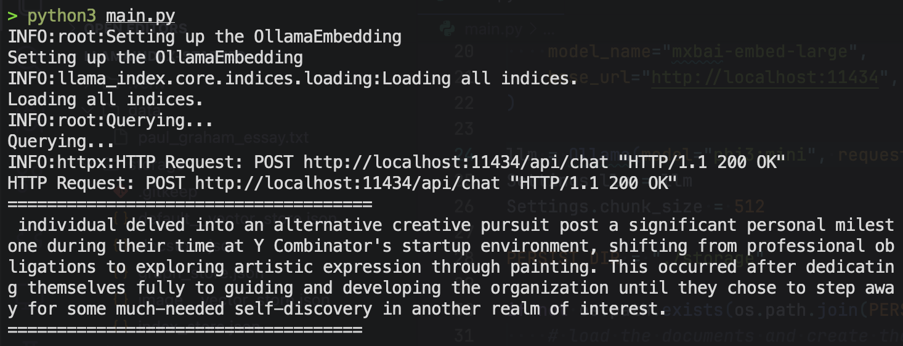

# Basic RAG using LlamaIndex

Simple example of a RAG pipeline using LlamaIndex to query in Paul Graham essay.

## 🛠️ Built with

* [LlamaIndex](https://www.llamaindex.ai/) - Framework for building context-augmented LLM applications
* [Ollama](https://ollama.com/) - Run LLMs on your own machine

## 🧠 Models use
* For indexing: `mxbai-embed-large`
* For querying: `phi3:mini`
